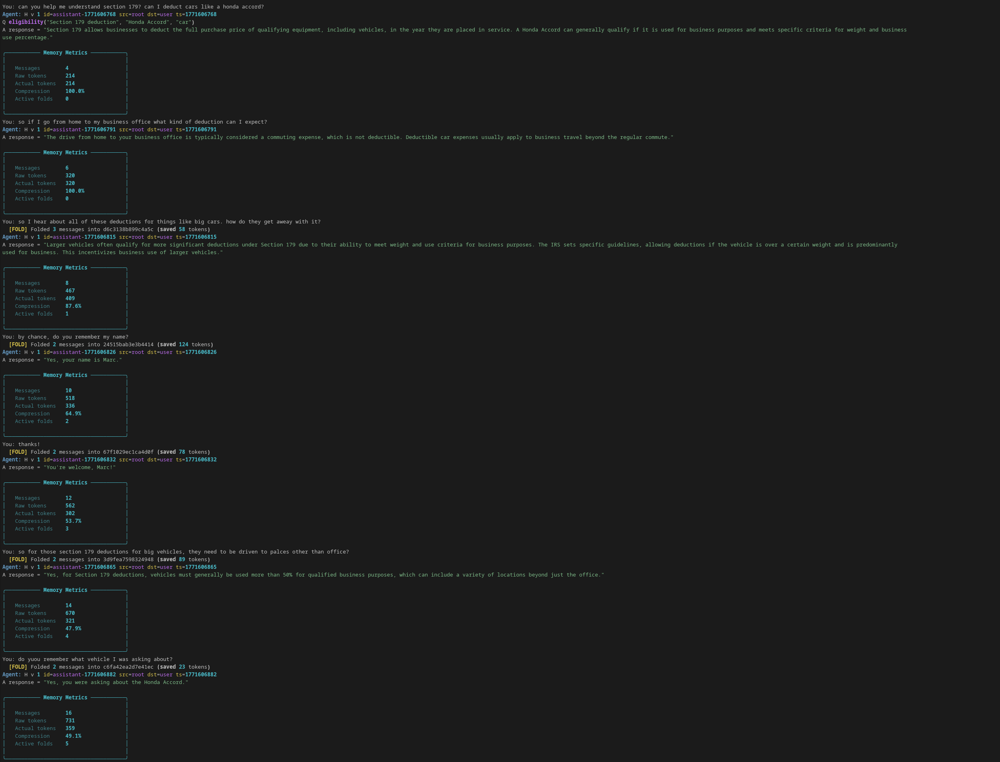

# SAG - Sentrius Agent Grammar

A purpose-built protocol for structured inter-agent communication. Parse, validate, correlate, and compress multi-agent conversations — without an LLM in the loop.

## The Problem

Multi-agent systems need to exchange structured instructions: execute actions, query state, assert facts, emit events, handle errors. Today there are three ways to do this:

| Approach | Advantage | Cost |
|----------|-----------|------|
| **Natural language** | Most compact per-message (~27% smaller than SAG before folding) | Unparseable, unvalidatable, lossy compression |
| **JSON** | Machine-readable | Verbose (59% larger than SAG), no semantics |
| **Purpose-built grammar** | Parseable, typed, validatable, compressible | Requires learning a DSL |

SAG is the third option. It exists because the first two break down in ways that matter as agent systems scale.

## Why Not Natural Language?

Let's be honest: NL is the most token-efficient format on a per-message basis. In our benchmarks, NL representations are ~27% smaller than SAG on raw character count. If all you need is to pass a single message between two agents, NL wins on size.

But this advantage inverts at conversation scale. NL's only compression option is summarization, which is inherently lossy — you can't recover the originals. SAG's fold protocol achieves 82-98% lossless compression, meaning SAG conversations stay within context budgets far longer than NL ones can. The ~27% per-message saving disappears quickly when NL forces you to either truncate history or spend LLM calls re-summarizing it.

And NL can't do any of the following:

**Deterministic parsing.** "Deploy app1 with version 42" and "Can you deploy version 42 of app1?" express the same intent but have no canonical form — extracting the verb, arguments, and structure requires an LLM call that may vary across runs. In SAG, that intent is `DO deploy("app1", version=42)` — one representation, parsed to the same typed AST every time, in microseconds, with no model call.

**Statement type discrimination.** "Set status to ready" and "What is the status?" are structurally identical in NL — both are strings. In SAG, the first is `A state.ready = true;` and the second is `Q status;`. The grammar enforces the distinction.

**Schema validation.** There's no way to verify that an NL instruction includes the required arguments, uses valid values, or targets a real endpoint — short of asking an LLM to check. SAG validates against registered schemas with no model call.

**Precondition enforcement.** "Deploy only if the balance exceeds 1000" is a wish in NL. In SAG, `DO deploy("app1") BECAUSE balance>1000;` is a machine-evaluable guardrail that blocks execution if the condition fails.

**Correlation and threading.** NL has no message IDs, no parent references, no TTL. Tracing a conversation across five agents means parsing timestamps and hoping. SAG headers carry `id`, `corr`, `src`, `dst`, and `ttl` natively.

**Lossless compression.** Summarizing 50 NL messages into a paragraph is lossy — you can't recover the originals. SAG's fold protocol compresses conversation segments at 82-98% ratios with **100% roundtrip fidelity**. Every message unfolds exactly as it was.

## Why Not JSON?

JSON is machine-readable, which solves the parsing problem. But it's the wrong tool for agent communication:

**Size.** JSON envelopes are 59% larger than equivalent SAG messages. Keys, braces, quotes, and structural overhead add up fast in context windows.

**No semantics.** A JSON object is a bag of key-value pairs. Nothing in the format distinguishes an action from a query from an assertion. That's application-layer code you have to write and maintain.

**No built-in protocol.** Correlation IDs, routing, TTL, priority, preconditions — JSON has none of these. Every team reinvents them as ad-hoc fields with ad-hoc validation.

**No compression protocol.** There's no JSON equivalent of fold/unfold. You're left with truncation or summarization, both lossy.

## SAG's Approach

SAG is a grammar that trades ~27% more tokens per-message than NL for: deterministic parsing, typed statement semantics, machine-processable validation, causality tracking, and lossless context compression that recovers the size gap and then some over multi-turn conversations.

Here's what a SAG message looks like:

```
H v 1 id=msg1 src=agent1 dst=agent2 ts=1234567890 corr=parent1 ttl=30
DO deploy("app1", version=42) P:security PRIO=HIGH BECAUSE balance>1000;
Q health.status WHERE cpu>80;
A state.ready = true;
IF ready==true THEN DO start() ELSE DO wait();
EVT deployComplete("app1");
ERR TIMEOUT "Connection timed out";
FOLD fold123 "Summary of prior work" STATE {"key": "value"};
RECALL fold123
```

One header, multiple typed statements, each deterministically parseable by an ANTLR4 grammar that generates lexers and parsers for both Java and Python.

## What You Get

**Parse once, use everywhere.** A single ANTLR grammar (`SAG.g4`) generates typed model objects in Java and Python with full feature parity. 146 Java tests, 179 Python tests.

**Validate without an LLM.** A four-layer sanitizer pipeline — grammar parse, routing guard, schema validation, guardrail check — catches malformed, misrouted, or unauthorized messages before they reach your agents. No model calls required.

**Track causality.** The correlation engine manages message IDs, parent threading, and conversation tree building automatically. Trace any message back through its full causal chain across agents.

**Compress without loss.** The fold protocol collapses completed conversation segments into compact summaries with preserved state. Unfold recovers the originals exactly. In benchmarks: 82-98% compression, 100% fidelity, 8.8x more conversation turns before context exhaustion.

## Benchmark Results

### SAG vs JSON: Compactness

| Format | Characters | vs JSON |
|--------|-----------|---------|
| SAG    | 2,862     | **59% smaller** |
| JSON   | 6,971     | baseline |
| NL     | 2,257     | 68% smaller |

SAG is 59% smaller than JSON while remaining fully parseable and validatable. NL is smaller per-message, but sacrifices everything listed above — and its only path to compression (summarization) is lossy, so the size advantage erodes over multi-turn conversations where SAG's lossless folding dominates.

### Fold Compression: Scalability

| Conversation | Fold Size | Compression |
|-------------|-----------|-------------|
| 50 messages | every 5   | 83% savings |
| 100 messages | every 10  | 91% savings |
| 200 messages | every 25  | 97% savings |

Compression ratios improve as conversations grow — exactly when you need them most.

### Context Budget: Practical Impact

With a 10K token budget, SAG+Folding enables **8.8x more conversation turns** before context exhaustion (228 turns linear vs 2000+ with folding).

### Roundtrip Fidelity

Fold → Unfold produces **100% identical** messages across all test conversations. Should be no information loss. But caveat emptor: this is still experimental.

## Quick Start

### Java
```bash
mvn clean install    # Build + test (146 tests)
```

### Python
```bash
cd python-sag
python -m venv .venv && source .venv/bin/activate
pip install antlr4-python3-runtime==4.13.1 pytest antlr4-tools
make generate && make test    # Generate ANTLR + run 179 tests
```

### Demo
```bash
cd demo
python demo.py --no-api                    # Echo mode
python demo.py --api-key $ANTHROPIC_API_KEY  # With Claude
```

#### Demo Example





## Usage

### Java
```java
Message message = SAGMessageParser.parse(sagText);
Header header = message.getHeader();
for (Statement stmt : message.getStatements()) {
    if (stmt instanceof ActionStatement action) {
        System.out.println("Verb: " + action.getVerb());
    }
}
```

### Python
```python
from sag import SAGMessageParser, ActionStatement

message = SAGMessageParser.parse(sag_text)
for stmt in message.statements:
    if isinstance(stmt, ActionStatement):
        print(f"Verb: {stmt.verb}")
```

### Sanitizer (Python)
```python
from sag import SAGSanitizer, SchemaRegistry, AgentRegistry

sanitizer = SAGSanitizer(
    schema_registry=schema_registry,
    agent_registry=agent_registry,
    default_context=context,
)
result = sanitizer.sanitize(raw_input)
if not result.valid:
    for error in result.errors:
        print(f"{error.error_type}: {error.message}")
```

### Fold Protocol
```python
from sag import FoldEngine, SAGMessageParser

engine = FoldEngine()
fold = engine.fold(messages, "Completed onboarding flow")
# Later...
original = engine.unfold(fold.fold_id)  # 100% fidelity
```

### Schema Profiles

SAG includes pre-built schema profiles — ready-to-use `SchemaRegistry` instances pre-populated with verb schemas for common domains. Instead of defining every verb from scratch, start with a profile and customize from there.

Schema validation is **opt-in** and focused on **correctness, not security**. Without any schemas registered, all verbs pass validation — SAG still parses, routes, correlates, and compresses normally. When schemas are registered, they enforce structural contracts: correct argument names, types, and optionally **value constraints** — enums (allowed values), patterns (regex for strings), and ranges (min/max for numbers). The security layers in SAG are the grammar parser (rejects malformed/free-text input) and the routing guard (restricts which agents can communicate).

#### Software Development Profile

The `SoftwareDevProfile` provides 12 verbs for CI/CD, DevOps, and software engineering workflows:

`build`, `test`, `deploy`, `rollback`, `review`, `merge`, `lint`, `scan`, `release`, `provision`, `monitor`, `migrate`

**Python**
```python
from sag import SoftwareDevProfile, SchemaValidator, ActionStatement

# Get a registry with all 12 verbs pre-configured
registry = SoftwareDevProfile.create_registry()
validator = SchemaValidator(registry)

# Validate an action against the schema
action = ActionStatement(
    verb="deploy",
    args=["webapp"],
    named_args={"env": "production", "replicas": 3},
)
result = validator.validate(action)
assert result.is_valid  # Passes — correct types and known args

# Missing required arg is caught
bad = ActionStatement(verb="deploy", args=[], named_args={})
result = validator.validate(bad)
assert not result.is_valid  # MISSING_ARG: 'app' at position 0

# Unknown args are rejected (strict contracts)
bad = ActionStatement(verb="deploy", args=["webapp"], named_args={"foo": "bar"})
result = validator.validate(bad)
assert not result.is_valid  # INVALID_ARGS

# Add your own verbs alongside the profile
from sag import VerbSchema, ArgType
registry.register(
    VerbSchema.Builder("notify")
    .add_positional_arg("channel", ArgType.STRING, True, "Notification channel")
    .add_named_arg("message", ArgType.STRING, True, "Message body")
    .build()
)
```

**Java**
```java
import com.sentrius.sag.profiles.SoftwareDevProfile;
import com.sentrius.sag.SchemaRegistry;
import com.sentrius.sag.SchemaValidator;
import com.sentrius.sag.model.ActionStatement;

SchemaRegistry registry = SoftwareDevProfile.createRegistry();
SchemaValidator validator = new SchemaValidator(registry);

ActionStatement action = new ActionStatement(
    "deploy", List.of("webapp"), Map.of("env", "production", "replicas", 3),
    null, null, null, null
);
SchemaValidator.ValidationResult result = validator.validate(action);
assert result.isValid();
```

**Plugging into the Sanitizer** — the profile integrates directly into SAG's four-layer validation pipeline:

```python
from sag import SoftwareDevProfile, SAGSanitizer, AgentRegistry, MapContext

registry = SoftwareDevProfile.create_registry()
agents = AgentRegistry()
agents.register("ci-agent", allowed_destinations=["deploy-agent", "test-agent"])
agents.register("deploy-agent", allowed_destinations=["ci-agent"])

sanitizer = SAGSanitizer(
    schema_registry=registry,
    agent_registry=agents,
    default_context=MapContext({"env": "staging"}),
)

# Raw SAG text is now grammar-parsed, route-checked, schema-validated,
# and guardrail-evaluated in one call
result = sanitizer.sanitize(raw_sag_text)
```

#### Value Constraints

Schema arguments support three optional constraint types that narrow the valid input space beyond type checks:

| Constraint | Applies To | Error Code | Description |
|-----------|-----------|------------|-------------|
| **Enum** (`allowed_values`) | Any type | `VALUE_NOT_ALLOWED` | Value must be in explicit list |
| **Pattern** (`pattern`) | STRING only | `PATTERN_MISMATCH` | Value must match regex |
| **Range** (`min_value`/`max_value`) | INTEGER, FLOAT | `VALUE_OUT_OF_RANGE` | Value must be within bounds |

All constraints are optional and `None`/`null` values pass all constraints. Constraints are checked in order: enum, then pattern, then range.

**Python**
```python
from sag import VerbSchema, ArgType

schema = (
    VerbSchema.Builder("deploy")
    .add_positional_arg("app", ArgType.STRING, True, "Application")
    .add_named_arg("env", ArgType.STRING, False, "Target environment",
                   allowed_values=["dev", "staging", "production"])
    .add_named_arg("replicas", ArgType.INTEGER, False, "Number of replicas",
                   min_value=1, max_value=100)
    .build()
)
```

**Java**
```java
VerbSchema schema = new VerbSchema.Builder("deploy")
    .addPositionalArg("app", ArgType.STRING, true, "Application")
    .addNamedArg("env", ArgType.STRING, false, "Target environment",
        List.of("dev", "staging", "production"), null, null, null)
    .addNamedArg("replicas", ArgType.INTEGER, false, "Number of replicas",
        null, null, 1, 100)
    .build();
```

The `SoftwareDevProfile` applies constraints to 13 arguments across 9 verbs — see the table below for details.

#### Available Verbs

| Verb | Required Args | Optional Named Args |
|------|--------------|---------------------|
| `build` | `target` (STRING) | `config` (STRING), `clean` (BOOLEAN) |
| `test` | `suite` (STRING) | `coverage` (BOOLEAN), `timeout` (INTEGER, 1-3600), `parallel` (BOOLEAN) |
| `deploy` | `app` (STRING) | `version` (INTEGER), `env` (STRING, enum: dev/staging/production), `replicas` (INTEGER, 1-100) |
| `rollback` | `app` (STRING) | `version` (INTEGER), `env` (STRING, enum: dev/staging/production) |
| `review` | `target` (STRING) | `reviewer` (STRING), `auto_merge` (BOOLEAN) |
| `merge` | `source` (STRING), `target` (STRING) | `strategy` (STRING, enum: merge/rebase/squash), `squash` (BOOLEAN) |
| `lint` | `target` (STRING) | `fix` (BOOLEAN), `config` (STRING) |
| `scan` | `target` (STRING) | `scan_type` (STRING, enum: sast/dast/sca/container), `severity` (STRING, enum: low/medium/high/critical) |
| `release` | `version` (STRING, pattern: `^\d+\.\d+\.\d+$`) | `tag` (STRING), `draft` (BOOLEAN), `notes` (STRING) |
| `provision` | `resource` (STRING) | `provider` (STRING, enum: aws/gcp/azure), `region` (STRING), `count` (INTEGER, 1-100) |
| `monitor` | `target` (STRING) | `interval` (INTEGER, 1-86400), `alert_threshold` (FLOAT, 0.0-1.0) |
| `migrate` | `target` (STRING) | `direction` (STRING, enum: up/down), `version` (STRING), `dry_run` (BOOLEAN) |

Use `SoftwareDevProfile.get_verbs()` / `SoftwareDevProfile.getVerbs()` to introspect the verb list at runtime.

## Statement Types

| Statement | Syntax | Purpose |
|-----------|--------|---------|
| Action    | `DO verb(args)` | Execute commands |
| Query     | `Q expr [WHERE constraint]` | Query state |
| Assert    | `A path = value` | Set state |
| Control   | `IF expr THEN stmt [ELSE stmt]` | Conditional |
| Event     | `EVT name(args)` | Emit events |
| Error     | `ERR code "message"` | Report errors |
| Fold      | `FOLD id "summary" [STATE {...}]` | Compress context |
| Recall    | `RECALL id` | Restore context |

## Project Structure

```
/                              Java library (Maven)
├── src/main/antlr4/SAG.g4       Canonical grammar
├── src/main/java/...             Java implementation
│   └── .../profiles/             Schema profiles (Java)
├── python-sag/                   Python library (pip-installable)
│   └── src/sag/profiles/        Schema profiles (Python)
├── bench/                        Benchmarking harness
├── demo/                         Live chatbot demo
└── .github/workflows/            CI for Java + Python
```

## CI/CD

GitHub Actions runs on every push/PR:
- **Java**: JDK 17, Maven build, 146 tests
- **Python**: Python 3.10-3.12 matrix, ANTLR generation, ruff lint, 179 tests
